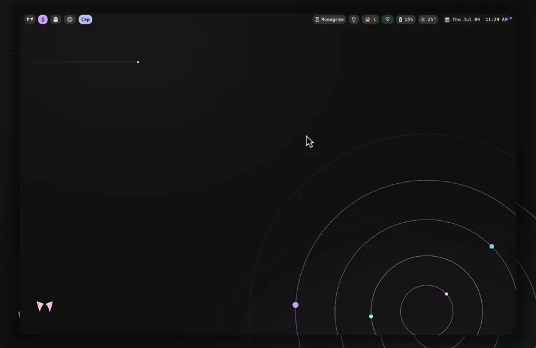
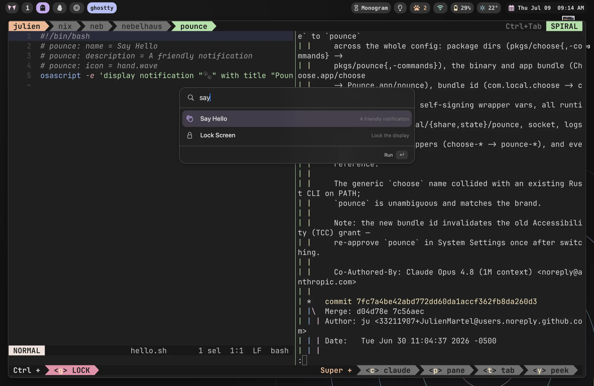

<div align="center">

<!-- identity banner — peach wordmark (assets/pounce-banner-rounded.png) -->


**summon, aim, pounce**

a native, scriptable, keyboard-first command palette for macOS


<!-- assets/demo.webp — trigger hotkey, fuzzy-type an app, then a command with a submenu -->


</div>

---

Pounce is a small Swift daemon that draws a fast, `dmenu`-style picker over your
screen. Hit a hotkey, fuzzy-type, hit return. It enumerates your installed apps
(boosting freshly-installed ones) and merges them with **your own commands** —
where every command is just a shell script.

It's the launcher for people who'd rather write a 5-line shell script than learn
a plugin SDK.

## why not Raycast / Alfred / Spotlight?

- **Every command is a file.** A command is one self-describing shell script —
  drop it in a folder and it's in the palette. No plugin API, no extension
  store, no account.
- **Native, tiny, no Electron.** A single Swift `LSUIElement` binary. It draws,
  picks, and gets out of the way.
- **Scriptable end to end.** Submenus are just a script that re-invokes `pounce`
  with a new list on stdin. Pipe anything in; act on whatever comes out.
- **Yours.** MIT, no telemetry, no cloud, no login.

Trade-off: it's deliberately minimal. If you want a marketplace of pre-built
extensions, use Raycast. If you want to *own* your launcher, pounce.

## install

### Nix flake

```nix
{
  inputs.pounce.url = "github:nebelhaus/pounce";

  # then, in a darwin/home-manager module:
  environment.systemPackages = [ inputs.pounce.packages.aarch64-darwin.default ];
}
```

Or try it without installing:

```sh
nix run github:nebelhaus/pounce -- --help
```

### Homebrew

```sh
brew tap nebelhaus/tap
brew install pounce
brew services start pounce       # run the palette daemon
pounce --request-accessibility   # approve the prompt (see below)
```

The formula installs a prebuilt `Pounce.app` from the release tarball, signed
with our Developer ID and notarized — no compile step, no Xcode Command Line
Tools. (Building from source is still a `nix build` away; see below.) Then bind
a hotkey to `pounce-palette` in whatever you use for hotkeys (skhd, AeroSpace's
`exec-and-forget`, …).

> The Developer ID identity is stable across releases, so the Accessibility
> grant survives `brew upgrade pounce` — nothing to re-approve. (A Nix build is
> still ad-hoc signed and does lose the grant on rebuild; see below.)

### Requirements

- macOS 14 Sonoma or later, Apple Silicon — the Homebrew release is arm64 only
- **Xcode Command Line Tools** — only to build from source: that path compiles
  against the system Swift toolchain via `xcrun` (`xcode-select --install`).

## accessibility (one-time)

Pounce needs the Accessibility permission to place its window and read the
frontmost app. After install:

```sh
pounce --request-accessibility   # approve the prompt
pounce --check-accessibility     # prints: true
```

> **Note on rebuilds:** a Nix store build is ad-hoc signed, so its code
> signature changes every rebuild and macOS silently drops the Accessibility
> grant. If you run pounce as a launch agent from Nix, copy the app to a stable
> path and re-sign it with a consistent identity once, then point the agent
> there. See [`nebelhaus`](https://github.com/nebelhaus/nebelhaus) for a working
> `launchd` wrapper that does this.

## usage

```sh
# a bare picker over lines on stdin (dmenu-style)
echo -e "one\ntwo\nthree" | pounce -p "pick one:"

# launcher mode: enumerate + rank installed apps, merge your commands
pounce --launcher --max-empty 7 -p "Search apps & actions..."
```

Common flags:

| flag | meaning |
|------|---------|
| `-p <prompt>` | placeholder / prompt text |
| `-i <sf-symbol>` | prompt icon (an SF Symbol name) |
| `--launcher` | also enumerate & rank installed apps, and launch them natively |
| `--max-empty <n>` | how many rows to show before the user types |
| `--clipboard` / `--emoji` / `--screenshots` / `--camera` | the built-in native modes |
| `--cheatsheet [path]` | overlay a cheatsheet (JSON) |
| `--transform '<filter>'` | act on the current selection: copy it (⌘C), pipe the text through the shell `<filter>`, paste back (⌘V) — e.g. `--transform 'tr "[:lower:]" "[:upper:]"'`. Forwarded to the daemon, which holds the grant. |
| `focus <op>` | Focus/DND (hush): `focus status\|toggle\|on\|off`, forwarded to the daemon |
| `--copy-file <path>` | copy a file (contents) to the clipboard |
| `--daemon` | run the resident daemon (what `launchd` starts; also hosts the ⌘Tab window switcher) |
| `--request-accessibility` / `--check-accessibility` | manage the Accessibility (TCC) grant |
| `--request-bluetooth` / `--check-bluetooth` | manage the Bluetooth (TCC) grant |
| `--version` | print the version |
| `-h`, `--help` | usage (the full flag list) |

## quick answers (inline calculator)

Type an expression-shaped query into the launcher and pounce answers it **right
in the palette** — pinned as the first row — instead of fuzzy-matching it against
your apps and commands. There's no trigger prefix: a query either parses as an
answer or it stays an ordinary search. Hit ⏎ to copy the result.

| you type | you get |
|----------|---------|
| `2*847` | **1,694** — arithmetic, parentheses, `pi`/`tau`, functions |
| `72 f in c` | **22.2 °C** — units (length, mass, temperature, …) |
| `100 usd in eur` | live currency, from offline ECB rates |
| `14:00 utc in pst` | timezone conversion |

Currency is the one engine that touches the network: it refreshes European
Central Bank reference rates in the background (pounce's only network call) and
answers from an in-memory cache, so a keystroke never blocks on I/O. It's **off
by default** — turn it on with `"quickAnswers": { "currency": true }` in
`config.json` (see below).

## writing a command (plugin)

A command is **one self-describing shell script**. That's the whole API. The
metadata lives in a `# pounce:` comment header, and the palette discovers
commands at runtime — no registry, no rebuild, no restart.

```sh
#!/bin/bash
# pounce: name = Say Hello
# pounce: description = A friendly notification
# pounce: icon = hand.wave
osascript -e 'display notification "🐾" with title "Pounce"'
```

Drop that in `~/.config/pounce/commands/hello.sh` and it's in the palette on
the next open.

> Using pounce as part of the [nebelhaus](https://nebelhaus.com) rice? The
> [Pounce guide](https://nebelhaus.com/guides/pounce/) and
> [Writing pounce commands](https://nebelhaus.com/guides/pounce-commands/) walk
> through the palette and how rice/machine-specific commands are layered on
> declaratively.

<!-- S14 — the hello.sh script (left) live in the palette (assets/command-is-a-file.webp) -->
<div align="center">

</div>

Header keys (all optional — the filename is the fallback name/id):

| key | meaning |
|-----|---------|
| `name` | title shown in the palette |
| `description` | subtitle |
| `icon` | an SF Symbol name |
| `submenu` | `true` if the script re-invokes `pounce` (see below) |

### where commands come from

The palette merges commands from these locations, in order — on a filename
clash the **later one wins**, so you can shadow any built-in by reusing its
filename:

1. the built-in set shipped with `pounce-commands` (the "official plugins")
2. directories baked in by Nix consumers:
   `pounce-commands.override { extraCommandDirs = [ ./my-commands ]; }`
3. `$POUNCE_COMMAND_PATH` (colon-separated directories)
4. `~/.config/pounce/commands` — yours, highest precedence

### optional plugins (off by default)

Beyond the built-in set there's a shelf of **optional plugins** in
[`pkgs/pounce-commands/optional/`](./pkgs/pounce-commands/optional). They ship
off by default because each one assumes a specific tool, service, or app on
your machine:

| id | what it does | assumes |
|----|--------------|---------|
| `audio` | switch sound output / input device | `brew install switchaudio-osx` |
| `bluetooth` | connect & disconnect paired devices (AirPods…) | `brew install blueutil` |
| `caffeinate` | keep the Mac awake (indefinitely or on a timer) | — (system `caffeinate`) |
| `docker` | start / stop / restart containers, tail logs | a docker engine (Docker Desktop, OrbStack, colima) |
| `github` | jump to your PRs, review requests, issues, repos | `brew install gh` + `gh auth login` |
| `spotify` | play / pause / skip / shuffle, copy song link | Spotify.app |
| `ssh` | pick a host from `~/.ssh/config`, connects (see `$POUNCE_TERMINAL_LAUNCHER`) | hosts in `~/.ssh/config` |
| `tailscale` | connect toggle, copy your / any peer's tailnet IP | Tailscale |

Enable the ones you use by id:

```nix
pounce-commands.override { plugins = [ "docker" "ssh" "tailscale" ]; }
```

An enabled plugin behaves exactly like a built-in — same palette discovery,
same `pounce-<id>` bin for hotkey bindings, still shadowable from your user
dir. Not on Nix? Every plugin is still just one script: copy it into
`~/.config/pounce/commands/` and it's live.

### submenus (two-step commands)

Set `# pounce: submenu = true` and have your script feed a new list back into `pounce`.
The daemon keeps the window up with a loading state instead of fading between
steps, so it feels like one continuous flow:

```sh
# commands/wifi.sh — pick a network, then join it
network=$(list_networks | pounce -p "WiFi network:")
[ -n "$network" ] && join_network "$network"
```

The batteries-included set (wifi, clipboard, emoji, screenshots, brew-services,
lock, force-quit, …) all live in `commands/` as worked examples — copy one and
go. (The `ports` command is the exception: it ships from `pkgs/pounce/ports`,
installed as `$out/bin/ports`, not from `pkgs/pounce-commands/commands/`.)

## configuration

Optional settings live in `~/.config/pounce/config.json`. The file is re-read on
every open, so edits apply on the next launch — no restart needed. Every key is
optional and falls back to a default.

```jsonc
{
  "theme": "nebelung",      // color palette: "nebelung" (default) or "mocha"
  "windowMode": "default",  // "default" or "compact"
  "hotkey": {
    "enabled": true,        // daemon grabs a global hotkey in-process (see below)
    "key": "space",         // "space", "return", "a"…"z", "0"…"9"
    "modifiers": ["cmd"]    // any of "cmd" / "shift" / "opt" / "ctrl"
  },
  "windows": {
    "enabled": false,       // MRU window switcher on ⌘Tab (see below; needs Accessibility)
    "key": "tab",
    "modifiers": ["cmd"]
  },
  "clipboard": {
    "enabled": true,
    "maxEntries": 200,
    "autoPaste": false,     // synthesize ⌘V into the prior app (needs Accessibility)
    "blacklistBundleIds": [] // apps whose copies are never recorded (password managers…)
  },
  "quickAnswers": {
    "currency": false       // enable the currency engine (its only network call — see above)
  },
  "apps": {
    "demoteBundleIds": [],  // apps ranked lower in the launcher (bundle IDs)
    "hideBundleIds": []     // apps hidden from the launcher entirely (bundle IDs)
  }
}
```

### the hotkey (near-instant open)

When the daemon is running it registers `hotkey` **in-process** (Carbon
`RegisterEventHotKey`). The keypress lands straight in the already-warm daemon,
so the palette opens with no shell, no client spawn, and no socket round-trip in
the way — the low-latency path. This replaces binding ⌘Space to `pounce-palette`
in an external hotkey daemon; if you keep such a binding, disable it (or set
`"hotkey": { "enabled": false }` here) so the combo doesn't fire twice.

For the daemon to serve commands on that path it discovers them from its **own
environment** — the same contract `pounce-palette` uses, so the launch agent
that starts the daemon should export them:

| var | meaning |
|---|---|
| `POUNCE_BUILTIN_DIR` | the built-in command set |
| `POUNCE_EXTRA_COMMAND_DIRS` | colon-separated dirs a packager layers on |
| `POUNCE_COMMAND_PATH` | colon-separated dirs for ad-hoc layering |

`~/.config/pounce/commands` is always searched last (highest precedence). When
the launch agent exports none of these (e.g. the Homebrew service), the daemon
falls back to `<prefix>/share/pounce/commands` derived from its own binary — the
same default `pounce-palette` uses — so the built-in commands still appear. If
the hotkey can't be registered at all the daemon logs that and leaves the
external-binder path working.

The case that actually bites is quieter, and comes in two flavours — both of
which `RegisterEventHotKey` *succeeds* on, so the daemon holds a registration it
never receives a press for:

- **A macOS shortcut owns the combo** — Spotlight on ⌘Space is the classic. At
  startup the daemon reads `com.apple.symbolichotkeys`, names the colliding
  shortcut, and warns: free the key in System Settings → Keyboard → Keyboard
  Shortcuts, then restart pounce.
- **An external hotkey tool owns the combo** — skhd, AeroSpace, or Raycast bound
  to the same key runs its own event tap *ahead* of Carbon, so it wins the press
  (and, if it's bound to `pounce-palette`, spawns a slow client every summon
  while the fast in-process path sits idle). The daemon logs a hint naming the
  likely culprit when it's asked to open the launcher over the socket while its
  own hotkey has never fired.

Either way the daemon also logs the hotkey's **first press**, so a swallowed
hotkey is distinguishable from a working one in the log — and

```sh
pounce doctor
```

rolls it all into one command: is the daemon up, is Accessibility granted, is the
hotkey **registered but never fired**, is a macOS shortcut or a running external
hotkey daemon (with a launcher binding in its config) shadowing it. Run it first
whenever the palette is slow to open or doesn't respond to the key.

The default **nebelung** palette is the desaturated Catppuccin used across the
[nebelhaus](https://github.com/nebelhaus) rice — it's baked into the binary at
build time straight from the [nebelung](https://github.com/nebelhaus/nebelung)
flake, so it never drifts from the rest of the theme. Set `"theme": "mocha"` for
stock Catppuccin Mocha.

### the window switcher (⌘Tab, opt-in)

With `"windows": { "enabled": true }` the daemon replaces the stock ⌘Tab app
switcher with an MRU **window** switcher:

- **⌘⇥, release** — toggle straight to the last window you were in, even on
  another workspace. No HUD, no ceremony.
- **hold ⌘, keep tapping ⇥** — walk every window, most-recently-used first
  (⌘⇧⇥ walks backwards; ↑/↓ also move).
- **hold ⌘ and type** — fuzzy-filter the list, ranked by frecency (which apps'
  windows you actually switch to). ↵ commits, ⎋ cancels, releasing ⌘ always
  lands on the selection.

macOS doesn't let ⌘Tab be rebound — the daemon takes it with an event tap,
which the system gates behind the **Accessibility** grant. Without the grant
(or during Secure Input, e.g. password fields) the tap stands down and stock
⌘Tab keeps working, so enabling this can never leave you unable to switch
windows. Grant Accessibility while the daemon is running and the switcher arms
itself within a couple of seconds — a watcher polls the grant, so no restart;
revoke it and the tap drops live so stock ⌘Tab resumes. It's off by default, and
flipping `windows.enabled` itself still needs a daemon restart.

Running [AeroSpace](https://github.com/nikitabobko/AeroSpace)? Each row gets a
workspace badge, and focusing goes through `aerospace focus --window-id` so a
window parked on another workspace surfaces correctly — that's the pairing the
[nebelhaus](https://nebelhaus.com) rice ships enabled.

## building from source

```sh
nix build            # -> ./result/Applications/Pounce.app + ./result/bin/pounce
```

Hacking on pounce as part of the wider rice? The
[workshop](https://github.com/nebelhaus/workshop)'s `bench try` rebuilds a whole
nebelhaus machine against your local checkout, uncommitted edits included.

## license

MIT © nebelhaus
